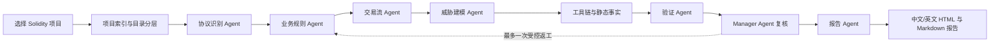

# YerbaMate

> **A protocol-aware smart contract audit workbench, designed and developed by Yuxuan Wu.**
> **面向协议语义理解的智能合约审计桌面工作台，由吴宇轩设计与开发。**

[English](#english) | [中文](#中文) | [Quick Start / 快速开始](#quick-start--快速开始) | [Tools / 工具链](#optional-security-toolchain--可选安全工具链)

YerbaMate is a Windows desktop application that turns a Solidity project into a structured, traceable audit workflow. It combines deterministic code analysis, optional industry tools, and role-specific AI agents to help users move from "a folder of contracts" to an evidence-backed audit report.

YerbaMate 是一个 Windows 桌面端智能合约审计系统。它将确定性静态分析、可选的行业工具链与按职责分工的 AI 智能体组合为可追踪的审计流水线，帮助用户从“一个合约目录”走向有证据、有过程记录的审计报告。

## Quick Start / 快速开始

### Use the ready-to-run release / 直接使用已构建版本

The repository does **not** include release binaries. Obtain the following files from the project release package, then choose either method:

仓库默认不提交体积较大的发布二进制文件。请从项目发布包中获取以下文件，任选一种方式运行：

| Package / 文件 | Recommended for / 适用场景 | How to use / 使用方式 |
| --- | --- | --- |
| `YerbaMate-Setup-0.3.2.exe` | Normal users; desktop shortcut and Start Menu integration / 普通使用与正式演示 | Double-click to install, then launch **YerbaMate** / 双击安装后从快捷方式启动 |
| `win_x64.zip` | Portable use, classroom demonstration, or packaging diagnostics / 便携运行、课堂展示、打包排查 | Extract the archive, then run `win_x64\\YerbaMate.exe` / 解压后运行 `win_x64\\YerbaMate.exe` |

> `*.blockmap` is an Electron differential-update metadata file. It is not needed to install or run YerbaMate.
>
> `*.blockmap` 是 Electron 的增量更新元数据文件，安装和运行 YerbaMate 时不需要单独使用。

### Minimum requirements / 最低环境要求

| Item / 项目 | Required? / 是否必需 | Notes / 说明 |
| --- | --- | --- |
| Windows 10/11 x64 | Yes / 是 | The current release is packaged for Windows x64 / 当前发布版面向 Windows x64 |
| Python 3.11+ in `PATH` | Yes for auditing / 运行审计时必需 | Electron UI is bundled, but the audit pipeline starts a local Python backend / Electron 界面已内置，审计流水线会启动本机 Python 后端 |
| Node.js / Electron | No / 否 | Needed only when developing from source / 仅源码开发需要 |
| Internet access | Optional / 可选 | Needed for cloud AI APIs, not for script-only analysis / 云端 AI 调用需要，纯自动化分析不需要 |

### First audit / 第一次审计

1. Start YerbaMate and read the in-app architecture introduction.
2. Create an audit, then select a local Solidity project folder.
3. Choose an analysis mode and selectively enable AI for individual agents.
4. Run the audit. Stage artifacts, AI summaries, tool results, and report sections appear as stages finish.
5. Review the bilingual report, inspect source code in the built-in explorer, export the result, or reopen it from audit history.

1. 启动 YerbaMate，先在首页查看系统架构说明。
2. 新建审计任务并选择本地 Solidity 项目目录。
3. 选择审计模式，并可为每个智能体单独启用或关闭 AI。
4. 启动审计。每个阶段完成后，产物、AI 小结、工具结果和报告内容会陆续显示。
5. 查看中英文报告，在内置源码浏览器中核对代码，导出结果，或从历史记录重新打开本次审计。

---

## 中文

### 项目简介

YerbaMate 并不把“工具扫描结果”直接包装成漏洞结论。它将一次审计拆成可解释的阶段：项目索引、协议识别、业务规则分析、交易流分析、威胁建模、外部工具执行、漏洞验证、管理复核与报告撰写。每个阶段都保留结构化产物，因此用户可以回看“为什么得到这个结论”，而不是只得到一份黑盒报告。

系统遵循 DeepAgents 风格的任务规划、子智能体协作、工具链调用、文件产物和跨会话记忆思想，但运行时由本项目自研实现，不依赖 LangChain 或 LangGraph。桌面端采用 Electron + React，审计后端采用 Python 标准库与 SQLite，API 层兼容 OpenAI 风格接口，可连接 SiliconFlow、OpenRouter、DeepSeek、Ollama 等服务。

### 核心亮点

| 亮点 | 说明 |
| --- | --- |
| **协议感知，而非关键词堆砌** | 识别 Vault、Lending、AMM、Token、NFT、Governance 等协议类型，并生成对应业务规则和交易流模板。 |
| **事实、假设、结论分层** | 静态扫描发现先作为 Facts 或 Needs Review 保存；只有经过上下文、工具或验证阶段支持后才进入正式 Findings，降低“把猜测当漏洞”的风险。 |
| **多智能体流水线** | 协议、业务逻辑、交易逻辑、威胁建模、验证、报告和管理智能体各司其职，并输出自己的摘要与建议。 |
| **管理智能体可控返工** | Manager Agent 检查各阶段结果的完整性与合理性，在必要时触发一次有边界的返工，兼顾质量、时间与模型成本。 |
| **AI 与自动化可独立选择** | 每个 Agent 可单独选择 AI 或脚本模式，并可配置模型、超时、源码共享范围与降级策略。未配置 API 时仍可完成本地自动化扫描。 |
| **实时可见的审计过程** | 无需等到结束才看结果；每个阶段完成后，前端立即展示中间产物、工具输出、AI 小结与建议。 |
| **真正面向项目而非单文件** | 能索引大型目录，区分生产源码、测试、Mock、脚本、依赖与生成文件，构建导入/继承信息，并避免测试代码污染生产风险结论。 |
| **本地优先与可追溯** | 审计记录、Agent 运行记录、模型调用元数据和跨会话案例记忆均通过 SQLite 保存；每次审计拥有独立的文件产物目录。 |
| **桌面工作台体验** | 包含项目介绍页、审计配置、模型/API 配置、工具状态、历史审计、双语报告、导出功能，以及带目录树、行号和语法高亮的源码浏览器。 |

### 审计流水线



### 智能体分工

| Agent | 输入 | 主要输出 |
| --- | --- | --- |
| Protocol Agent | 项目结构、合约与标准特征 | 协议类型、置信度、模块划分、关键资产与角色 |
| Business Logic Agent | 协议结论、合约事实 | 业务不变量、权限规则、关键状态关系 |
| Transaction Logic Agent | 入口函数、调用关系、协议模板 | 可读交易路径与异常组合风险 |
| Threat Modeling Agent | 业务规则、交易流、外部调用与权限事实 | 攻击面、风险假设、优先核查项 |
| Verification Agent | 风险假设、工具结果、源码上下文 | 已确认/待复核/已驳回状态，及 Foundry 验证模板 |
| Manager Agent | 所有阶段的质量信号与缺失项 | 合理性复核、一次受控返工建议、流水线摘要 |
| Report Agent | 经过分层的事实、假设、验证结论 | 中文/英文 Markdown 与 HTML 报告，以及个性化审计意见 |

### 自动化能力与可选 AI

没有 API Key 时，YerbaMate 仍可完成项目发现、Solidity 轻量解析、协议特征提取、入口点与访问控制索引、外部调用事实收集、规则化风险假设、外部工具调度和模板化报告。

配置 OpenAI 兼容 API 后，AI 会在各 Agent 的边界内补充协议语义解释、交易路径归纳、风险上下文复核、阶段摘要和报告意见。模型输入经过结构化与长度限制，可减少一次性发送大量源码导致的超时。所有 AI 步骤均可关闭，且每个 Agent 可以使用不同模型或共享同一套 API 配置。

### 可选安全工具链

这些工具不是启动 YerbaMate 的前置条件。安装后，应用会自动探测它们，并在审计配置启用时调用；工具缺失或项目不兼容时会记录为 `skipped`，不会中断整个审计。

| 工具 | 在 YerbaMate 中的作用 | 安装提示 |
| --- | --- | --- |
| `solc` | Solidity 编译器，辅助编译与工具兼容性 | 安装 Solidity 编译器并确保 `solc --version` 可用 |
| Slither | 静态分析、检测器结果与风险事实 | `pip install slither-analyzer` |
| Foundry / `forge` | 构建和运行已有 Solidity 测试；验证阶段生成测试模板 | 按 Foundry 官方方式安装，并确保 `forge --version` 可用 |
| Semgrep | 通用规则扫描与 JSON 结果汇总 | `pip install semgrep` |
| Echidna | 基于属性的模糊测试；需要项目已有 Echidna/Crytic 配置 | 按官方发布包或包管理器安装 |
| Aderyn | Solidity 静态审计报告生成 | 按 Aderyn 官方说明安装，并确保 `aderyn --version` 可用 |

> 对于多数项目，建议优先安装 **solc、Slither 和 Foundry**。Semgrep、Echidna、Aderyn 可按项目规模与验证需求补充。YerbaMate 也会探测 Halmos 环境，为后续符号执行扩展预留入口。

### 从源码开发

```powershell
# 1. 安装 Node.js 20+ 与 Python 3.11+
npm install

# 2. 启动 Electron 开发模式
npm run electron:dev

# 3. 运行后端测试
python -m unittest discover -s tests -v

# 4. 构建安装程序
npm run electron:build
```

常用命令：

```powershell
# 仅启动前端预览
npm run dev

# 仅构建前端
npm run build

# 命令行审计示例
python main.py audit .\examples\SimpleVault
python main.py audit .\examples\SimpleVault --json
```

### 数据与隐私

- API Key 仅保存于本地应用配置，不应提交到仓库；请使用 `.env` 或本地设置页面管理密钥。
- 审计数据、SQLite 数据库、工具原始输出和报告保存在运行时数据目录，默认不纳入 Git。
- 便携版通常将运行数据保存到发布目录的同级运行目录；安装版通常保存到程序运行数据目录。可通过环境变量 `YERBAMATE_DATA_DIR` 指定自定义位置。
- 云端模型仅会收到当前 Agent 被允许共享的摘要/源码片段。使用前请根据项目保密要求配置源码共享范围。

---

## English

### Overview

YerbaMate is not a thin wrapper that labels every scanner hit as a vulnerability. It models an audit as an explainable sequence: project indexing, protocol recognition, business-rule analysis, transaction-flow analysis, threat modeling, external-tool execution, verification, manager review, and report writing. Each stage produces structured artifacts, so a reader can trace *why* a conclusion was reached rather than receiving a black-box report.

The system adopts DeepAgents-style task planning, sub-agent delegation, tool use, file artifacts, and cross-session memory, while using a self-built local runtime instead of LangChain or LangGraph. The desktop workbench uses Electron, React, and TypeScript; the audit backend uses Python and SQLite; and the model layer accepts OpenAI-compatible APIs such as SiliconFlow, OpenRouter, DeepSeek, and Ollama.

### Why YerbaMate

| Capability | What it means in practice |
| --- | --- |
| **Protocol-aware analysis** | Recognizes Vault, Lending, AMM, Token, NFT, Governance, and mixed-library patterns, then applies protocol-specific rules and transaction templates. |
| **Facts are separated from conclusions** | Scanner output becomes facts or review hypotheses first. A severity-bearing finding requires context, tool evidence, or verification support. |
| **Role-specific agent pipeline** | Protocol, business logic, transaction, threat modeling, verification, reporting, and manager agents own distinct responsibilities and produce their own summaries. |
| **Bounded manager rework** | The Manager Agent checks stage quality and can request one controlled rework, improving coherence without runaway cost or endless loops. |
| **AI optional at every stage** | Each agent can use AI or deterministic scripts independently, with per-agent model selection, source-sharing control, timeout settings, and fallback behavior. |
| **Live evidence, not end-only output** | Artifacts, AI notes, tool results, and report sections become visible as each stage finishes. |
| **Project-scale awareness** | Distinguishes production code, tests, mocks, scripts, dependencies, and generated files; indexes imports and inheritance; prevents test fixtures from polluting production risk scoring. |
| **Local-first traceability** | SQLite stores audit runs, agent runs, findings, model-call metadata, and case memory, while each run owns a dedicated artifact directory. |
| **Desktop-native review workflow** | Includes onboarding, audit and API configuration, tool status, audit history, bilingual reports, export, and an IDE-style source explorer with a collapsible tree, line numbers, and syntax highlighting. |

### Audit workflow


### Agents and responsibilities

| Agent | Receives | Produces |
| --- | --- | --- |
| Protocol Agent | Project structure, contract and standard signals | Protocol classification, confidence, modules, critical assets and roles |
| Business Logic Agent | Protocol result and contract facts | Invariants, authorization rules, and key state relationships |
| Transaction Logic Agent | Entrypoints, call context, protocol templates | Readable transaction paths and unsafe-composition candidates |
| Threat Modeling Agent | Rules, flows, external-call and privilege facts | Attack surface, hypotheses, and review priorities |
| Verification Agent | Hypotheses, tool output, source context | Confirmed / needs-review / rejected status and Foundry verification templates |
| Manager Agent | Quality signals and omissions across stages | Coherence review, one bounded rework recommendation, and pipeline summary |
| Report Agent | Layered facts, hypotheses, and verification results | Bilingual Markdown/HTML reports and a contextual audit opinion |

### Optional security toolchain

These tools are optional. Once installed, YerbaMate discovers them locally and invokes enabled tools during an audit. A missing tool or an incompatible project is reported as `skipped`; it does not break the pipeline.

| Tool | YerbaMate integration |
| --- | --- |
| `solc` | Solidity compiler availability and tool compatibility |
| Slither | Static detector execution, normalized detector results, and evidence import |
| Foundry / `forge` | `forge build`, existing test execution, and verification-test templates |
| Semgrep | Rule scan with JSON result summarization |
| Echidna | Property-based fuzzing when an Echidna/Crytic configuration is present |
| Aderyn | Solidity static-audit report generation |

For most projects, start with **solc, Slither, and Foundry**. Add Semgrep, Echidna, and Aderyn as the project and validation scope grows. The environment probe also recognizes Halmos for future symbolic-execution work.

### Develop from source

```powershell
# Prerequisites: Node.js 20+ and Python 3.11+
npm install
npm run electron:dev

# Test the audit backend
python -m unittest discover -s tests -v

# Package the Windows desktop application
npm run electron:build
```

### Data and privacy

- API keys remain local and must never be committed. Manage them through `.env` or the local settings screen.
- Audit artifacts, SQLite data, raw tool output, and generated reports live in runtime data directories and are excluded from Git.
- Cloud models receive only the summaries or source excerpts enabled for the relevant agent. Configure source sharing according to the confidentiality of the project being audited.
- Set `YERBAMATE_DATA_DIR` to choose a custom runtime-data location.

## Project structure / 项目结构

```text
YerbaMate/
├─ electron/                 # Electron main process and secure preload bridge
├─ src/                      # React + TypeScript desktop interface
├─ sentinel/
│  ├─ agents/                # Specialized audit agents and Manager Agent
│  ├─ core/                  # Pipeline runtime, SQLite persistence, model adapter
│  └─ tools/                 # Solidity parser, tool discovery, external analyzers
├─ tests/                    # Pipeline and regression tests
├─ examples/                 # SimpleVault and external-project examples
├─ Pic/                      # Application icon and visual assets
├─ main.py                   # Python audit CLI entry point
└─ package.json              # Electron/Vite build configuration
```

## Scope note / 使用边界

YerbaMate is an audit-assistance and research system. It improves triage, evidence organization, tool orchestration, and review efficiency, but it does **not** replace a professional security audit or a human decision before production deployment.

YerbaMate 用于审计辅助与智能体工程研究，能够提升信息整理、工具编排和复核效率，但不能替代专业安全审计，也不能替代生产部署前的人类安全决策。
